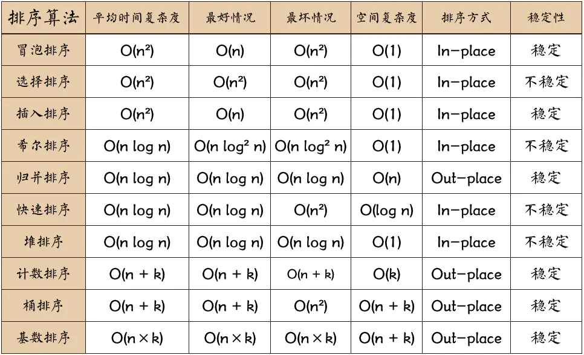

# Basic Sorting Algorithms
- [Basic Sorting Algorithms](#basic-sorting-algorithms)
  - [一、基础概念](#一基础概念)
    - [1.1 稳定排序](#11-稳定排序)
    - [1.2 排序方式](#12-排序方式)
  - [二、排序算法实现（JavaScript）](#二排序算法实现javascript)
    - [2.1 Bubble Sort](#21-bubble-sort)
    - [2.2 Selection Sort](#22-selection-sort)
    - [2.3 Insertion Sort](#23-insertion-sort)
    - [2.4 Shell Sort](#24-shell-sort)
    - [2.5 Merge Sort](#25-merge-sort)
    - [2.6 Quick Sort](#26-quick-sort)


<div align=center>

</div>

## 一、基础概念
### 1.1 稳定排序
待排序的记录序列中可能存在两个或两个以上关键字 `相等` 的记录。排序前的序列中 `Ri` 领先于 `Rj` （即 `i < j`），若在排序后的序列中 `Ri` 仍然领先于 `Rj`，则称所用的方法是稳定的

### 1.2 排序方式
- `in-place`：占用常数内存
- `out-place`：占用额外内存

## 二、排序算法实现（JavaScript）
### 2.1 Bubble Sort
> 冒泡排序（Bubble Sort）依次比较相邻的两个数，如果不符合排序规则，则调换两个数的位置。这样一遍比较下来，能够保证最大（或最小）的数排在最后一位，再对最后一位以外的数组，重复前面的过程，直至全部排序完成。
```JavaScript
function bubbleSort(arr) {
  const len = arr.length
  for (let i = 0; i < len - 1; i++) {
    for (let j = 0; j < len - 1 - i; j++) {
      if (arr[j] > arr[j + 1]) {
        [arr[j], arr[j + 1]] = [arr[j + 1], arr[j]]
      }
    }
  }

  return arr
}
```

### 2.2 Selection Sort
> 选择排序（Selection Sort）与冒泡排序类似，也是依次对相邻的数进行两两比较。不同之处在于，它不是每比较一次就调换位置，而是一轮比较完毕，找到最大值（或最小值）之后，将其放在正确的位置，其他数的位置不变
```JavaScript
function selectionSort(arr) {
  const len = arr.length
  let minIndex

  for (var i = 0; i < len - 1; i++) {
    minIndex = i
    for (var j = i + 1; j < len; j++) {
      if (arr[j] < arr[minIndex]) {
        minIndex = j
      }
    }

    if (i !== minIndex) {
      [arr[i], arr[minIndex]] = [arr[minIndex], arr[i]]
    }
  }

  return arr
}
```

### 2.3 Insertion Sort
> 插入排序（insertion sort）比前面两种排序方法都更有效率。它将数组分成“已排序”和“未排序”两部分，一开始的时候，“已排序”的部分只有一个元素，然后将它后面一个元素从“未排序”部分插入“已排序”部分，从而“已排序”部分增加一个元素，“未排序”部分减少一个元素。以此类推，完成全部排序
```JavaScript
function insertionSort(arr) {
  const len = arr.length
  let preIndex, current

  for (let i = 1; i < len; i++) {
      preIndex = i - 1
      current = arr[i]
      while(preIndex >= 0 && arr[preIndex] > current) {
          arr[preIndex + 1] = arr[preIndex]
          preIndex--
      }
      arr[preIndex + 1] = current
  }

  return arr
}
```

### 2.4 Shell Sort
> 希尔排序（shell Sort）是插入排序的一种更高效的改进版本，基本思想是：先将整个待排序的记录序列分割成为若干子序列分别进行直接插入排序，待整个序列中的记录"基本有序"时，再对全体记录进行依次直接插入排序
```JavaScript
function shellSort(arr) {
  const len = arr.length
  let gap = 1, preIndex, current

  while (gap < len/3) {
    gap = gap * 3 + 1
  }

  for (gap; gap > 0; gap = Math.floor(gap / 3)) {
    for (let i = gap; i < len; i++) {
      current = arr[i]
      preIndex = i - gap
      while (preIndex >= 0 && arr[preIndex] > current) {
        arr[preIndex + gap] = arr[preIndex]
        preIndex-= gap
      }
      arr[preIndex + gap] = current
    }
  }

  return arr
}
```

### 2.5 Merge Sort
```JavaScript
// 不修改 原数组
function mergeSort(arr) {
  if (arr.length < 2) return arr

  const mid = arr.length >> 1
  const left = mergeSort(arr.slice(0, mid))
  const right = mergeSort(arr.slice(mid))
  let res = []
  while(left.length && right.length) {
    if (left[0] < right[0]) {
      res.push(left.shift())
    } else {
      res.push(right.shift())
    }
  }
  left.length && (res = res.concat(left))
  right.length && (res = res.concat(right))
  return res
}

// 修改 原数组
function mergeSort(arr) {
  if (arr.length < 2) return arr

  const mid = arr.length >> 1
  const left = mergeSort(arr.slice(0, mid))
  const right = mergeSort(arr.slice(mid))

  let l = 0, r = 0
  while (l < left.length || r < right.length) {
    arr[l + r] = (r === right.length || left[l] <= right[r]) ? left[l++] : right[r++]
  }
  return arr
}
```

### 2.6 Quick Sort
```JavaScript
// 不修改 原数组
function quickSort(arr) {
　if (arr.length <= 1) return arr

  const pivotIndex = Math.floor(arr.length / 2)
  const pivot = arr[pivotIndex]
  const left = []
  const right = []

　for (let i = 0; i < arr.length; i++){
  if (i === pivotIndex) continue
    arr[i] < pivot ? left.push(arr[i]) : right.push(arr[i])
　}

　return quickSort(left).concat(pivot, quickSort(right))
}

// 修改 原数组
function quickSort(arr, left = 0, right = arr.length-1) {
  if (left >= right) return arr
  const pivotIndex = findPivotIndex(arr, left, right)
  quickSort(arr, left, pivotIndex - 1)
  quickSort(arr, pivotIndex, right)

  return arr
}

function findPivotIndex(arr, left, right){
  const pivot = arr[Math.floor((right + left) / 2)]
  while (left <= right) {
    while (arr[left] < pivot) {
      left++
    }
    while (arr[right] > pivot) {
      right--
    }
    if (left <= right) {
      [arr[left], arr[right]] = [arr[right], arr[left]]
      left++
      right--
    }
  }

  return left
}
```