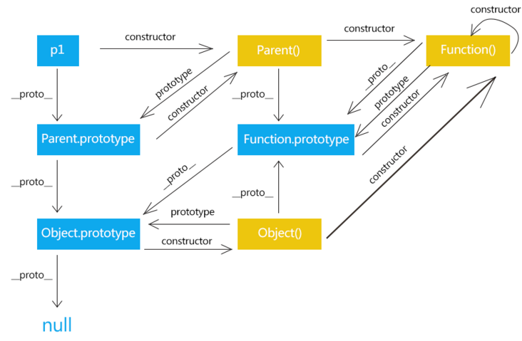

# JavaScript 原型 && 原型链


## prototype
每个 `函数` 都有一个 `prototype` 属性，指向一个对象，这个对象是调用 `该构造函数` 而创建的 `实例` 的 `原型`

**原型**：每一个 `对象(null除外)` 在创建的时候就会与之关联另一个对象，这个对象就是我们所说的原型，每一个对象都会从原型 `"继承"` 属性


## \_\_proto\_\_
每个 `对象(除了 null )` 都具有的一个属性，叫 `__proto__`，这个属性会指向该对象的原型


## constructor
每个 `原型` 都有一个 `constructor` 属性指向关联的 `构造函数`  


## 原型链
```JavaScript
var arr = []
arr.push // ƒ push() { [native code] }
arr.hasOwnProperty // ƒ hasOwnProperty() { [native code] }
```
为什么空数组 `arr` 可以访问 `push` 和 `hasOwnProperty`？

```JavaScript
arr.__proto__ === Array.prototype
arr.push === Array.prototype.push

arr.__proto__.__proto__ === Object.prototype
arr.hasOwnProperty === Object.prototype.hasOwnProperty
```

