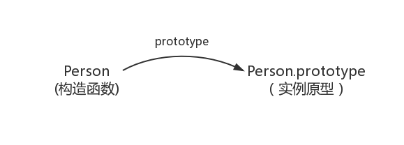

- [JavaScript 原型 && 原型链](#javascript-原型--原型链)
  - [prototype](#prototype)
  - [\_\_proto\_\_](#__proto__)
  - [constructor](#constructor)
  - [原型链](#原型链)
  - [相关题目](#相关题目)
    - [问题一：输出值](#问题一输出值)
# JavaScript 原型 && 原型链


## prototype
每个 `函数` 都有一个 `prototype` 属性，指向一个对象，这个对象是调用 `该构造函数` 而创建的 `实例` 的 `原型`

**原型**：每一个 `对象(null除外)` 在创建的时候就会与之关联另一个对象，这个对象就是我们所说的原型，每一个对象都会从原型 `"继承"` 属性


## \_\_proto\_\_
每个 `对象(除了 null )` 都具有的一个属性，叫 `__proto__`，这个属性会指向该对象的原型


## constructor
每个 `原型` 都有一个 `constructor` 属性指向关联的 `构造函数`  


## 原型链
```JavaScript
var arr = []
arr.push // ƒ push() { [native code] }
arr.hasOwnProperty // ƒ hasOwnProperty() { [native code] }
```
为什么空数组 `arr` 可以访问 `push` 和 `hasOwnProperty`？

```JavaScript
arr.__proto__ === Array.prototype
arr.push === Array.prototype.push

arr.__proto__.__proto__ === Object.prototype
arr.hasOwnProperty === Object.prototype.hasOwnProperty
```

## 相关题目
### 问题一：输出值
```JavaScript
function Foo() {
  Foo.a = function() {
      console.log(1)
  }
  // 该方法直接挂载在实例对象上
  this.a = function() {
      console.log(2)
  }
}
// 实例对象通过 __proto__ 原型链访问 prototype
Foo.prototype.a = function() {
    console.log(3)
}
Foo.a = function() {
    console.log(4)
}
Foo.a(); // 4
let obj = new Foo();
obj.a(); // 2
Foo.a(); // 1
Foo.prototype.a(); // 3

/**  -------------解析-----------------   */
function Foo() {
    Foo.a = function() {
        console.log(1)
    }
    this.a = function() {
        console.log(2)
    }
}
// 以上只是 Foo 的构建方法，没有产生实例，此刻也没有执行

Foo.prototype.a = function() {
    console.log(3)
}
// 现在在 Foo 上挂载了原型方法 a ，方法输出值为 3

Foo.a = function() {
    console.log(4)
}
// 现在在 Foo 上挂载了直接方法 a ，输出值为 4

Foo.a();
// 立刻执行了 Foo 上的 a 方法，也就是刚刚定义的，所以
// # 输出 4

let obj = new Foo();
/* 这里调用了 Foo 的构建方法。Foo 的构建方法主要做了两件事：
1. 将全局的 Foo 上的直接方法 a 替换为一个输出 1 的方法。
2. 在新对象上挂载直接方法 a ，输出值为 2。
*/

obj.a();
// 因为有直接方法 a ，不需要去访问原型链，所以使用的是构建方法里所定义的 this.a，
// # 输出 2

Foo.a();
// 构建方法里已经替换了全局 Foo 上的 a 方法，所以
// # 输出 1

Foo.prototype.a();
// this.a 是挂载在实例对象上，不影响 prototype
```