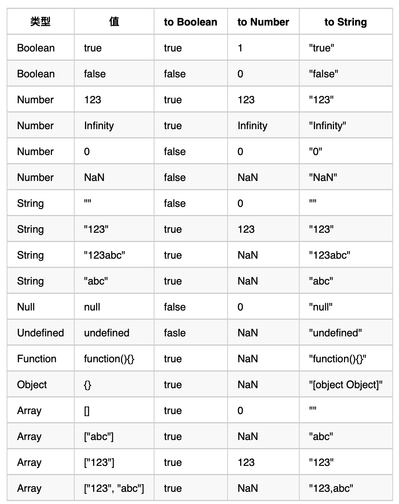

# JavaScript 隐式类型转换
## 一、预备知识
### 1.1 valueOf
valueOf，表示对象的原始值。默认的 valueOf 方法返回这个对象本身，数组、函数、正则简单的继承了这个默认方法，也会返回对象本身。  
日期是一个例外，它会返回它的一个内容表示: 1970 年 1 月 1 日以来的毫秒数
```JavaScript
var date = new Date()
console.log(date.valueOf()) // 1631072425075
```
### 1.2 toString
所有的对象除了 `null` 和 `undefined` 之外的任何值都具有 `toString` 方法，通常情况下，它和使用 `String` 方法返回的结果一致。`toString` 方法的作用在于返回一个反映这个对象的字符串。

- 对象的 toString 方法会根据这个对象的 `[[class]]` 内部属性，返回 "[object `[[class]]`]" 组成的字符串
- 数组的 toString 方法将每个数组元素转换成一个字符串，并在元素之间添加逗号后合并成结果字符串。
- 函数的 toString 方法返回源代码字符串。
- 日期的 toString 方法返回一个可读的日期和时间字符串。
- RegExp 的 toString 方法返回一个表示正则表达式直接量的字符串。

```JavaScript
console.log(({}).toString()) // [object Object]
console.log([].toString()) // ""
console.log([null].toString()) // ""
console.log([undefined].toString()) // ""
console.log([0].toString()) // 0
console.log([1, 2, 3].toString()) // 1,2,3
console.log((function(){var a = 1;}).toString()) // function (){var a = 1;}
console.log((/\d+/g).toString()) // /\d+/g
console.log((new Date(2010, 0, 1)).toString()) // Fri Jan 01 2010 00:00:00 GMT+0800 (CST)
```
### 1.3 ToPrimitive 规则
`引用类型` 向 `原始类型` 转变的规则，函数语法表示如下：

```JavaScript
ToPrimitive(input[, PreferredType])
```
- 第一个参数是 input，表示要处理的输入值。
- 第二个参数是 PreferredType，非必填，表示希望转换成的类型，有两个值可以选，Number 或者 String

当不传入 PreferredType 时，如果 input 是日期类型，相当于传入 String，否则，都相当于传入 Number

#### 如果是 ToPrimitive(obj, Number)，处理步骤如下：

1. 如果 obj 为 基本类型，直接返回
1. 否则，调用 valueOf 方法，如果返回一个原始值，则 JavaScript 将其返回。
1. 否则，调用 toString 方法，如果返回一个原始值，则 JavaScript 将其返回。
1. 否则，JavaScript 抛出一个类型错误异常。

#### 如果是 ToPrimitive(obj, String)，处理步骤如下：

1. 如果 obj为 基本类型，直接返回
1. 否则，调用 toString 方法，如果返回一个原始值，则 JavaScript 将其返回。
1. 否则，调用 valueOf 方法，如果返回一个原始值，则 JavaScript 将其返回。
1. 否则，JavaScript 抛出一个类型错误异常。

## 二、数学运算符中的类型转换
因为 JavaScript 并没有类型声明，所以任意两个变量或字面量，都可以做加减乘除。
### 2.1 减、乘、除
在对各种 非Number 类型运用数学运算符 `- * /`时，会先将 非Number 类型转换为 Number 类型

```JavaScript
1 - true // 0， 首先把 true 转换为数字 1， 然后执行 1 - 1
1 - null // 1,  首先把 null 转换为数字 0， 然后执行 1 - 0
1 * undefined //  NaN, undefined 转换为数字是 NaN
2 * ['5'] //  10， ['5'] 通过 ToPrimitive 变为'5', 然后再变成数字 5
```
### 2.2 加法的特殊性
JavaScript 里 `+` 还可以用来拼接字符串。谨记以下3条：

- 当一侧为 String 类型，被识别为字符串拼接，并会优先将另一侧转换为字符串类型
- 当一侧为 Number 类型，另一侧为 原始类型，则将原始类型转换为 Number 类型
- 当一侧为 Number 类型，另一侧为 引用类型，将 引用类型 和 Number 类型转换成 字符串 后拼接

以上 3 点，优先级从高到低

```JavaScript
123 + '123' // 123123   （规则1）
123 + null  // 123    （规则2）
123 + true // 124    （规则2）
123 + {}  // 123[object Object]    （规则3）
```
## 三、逻辑语句中的类型转换
当我们使用 `if` `while` `for` 语句时，我们期望表达式是一个 `Boolean`，所以一定伴随着隐式类型转换
### 3.1 单个变量
如果只有单个变量，会先将变量转换为 `Boolean` 值

只有下面七种情况会转为 false
1. `false`
1. `null`
1. `undefined`
1. `NaN`
1. `''`
1. `0`
1. `-0`
### 3.2 使用 == 比较中的6条规则
虽然一般都是严格使用 `===`，不过了解 `==` 的习性还是很有必要的

根据 `==` 两侧的数据类型，总结出 6 条规则：
- 规则 1：`NaN` 和 其他任何类型（包括他自己）比较永远返回 false
    ```JavaScript
    NaN == NaN // false
    ```
- 规则 2：Boolean 和其他任何类型比较，Boolean 首先被转换为 Number 类型
    ```JavaScript
    true == 1  // true
    true == '2'  // false, 先把 true 变成 1，而不是把 '2' 变成 true
    true == ['1']  // true, 先把 true 变成 1， ['1']拆箱成 '1', 再参考规则3
    true == ['2']  // false, 同上
    undefined == false // false ，首先 false 变成 0，然后参考规则4
    null == false // false，同上
    ```
- 规则 3：String 和 Number 比较，先将 String 转换为 Number 类型
    ```JavaScript
    123 == '123' // true, '123' 会先变成 123
    '' == 0 // true, '' 会首先变成 0
    ```
- 规则 4：null == undefined 比较结果是 true，除此之外，null、undefined 和其他任何结果的比较值都为 false
    ```JavaScript
    null == undefined // true
    null == '' // false
    null == 0 // false
    null == false // false
    undefined == '' // false
    undefined == 0 // false
    undefined == false // false
    ```
- 规则 5：原始类型 和 引用类型 做比较时，引用类型 会依照ToPrimitive 规则转换为 原始类型
    ```JavaScript
    // true, 对象和字符串比较，对象通过 toString 得到一个基本类型值
    '[object Object]' == {} 

    // true, 同上  [1, 2, 3]通过 toString 得到一个基本类型值
    '1,2,3' == [1, 2, 3] 
    ```
- 规则 6：引用类型和引用类型做比较时，是对引用类型的存储地址做比较
    ```JavaScript
    [] == [] // false
    {} == {} // false
    ```

### 3.3 使用 `>` `<` `>=` `<=` 比较中的 4 条规则
- 规则 1：`NaN` 和 其他任何类型（包括他自己）比较永远返回 false
    ```JavaScript
    NaN >= NaN // false
    NaN <= NaN // false
    ```
- 规则 2：引用类型 先调用 `Primitive(obj, Number)` 转换为 原始类型
- 规则 3：如果两边的值都是 String，则按 code unit 比较
- 规则 4：否则，将两边的值 转为 Number 比较
## 四、一些题目
```JavaScript
/**
 * 第一步，![] 会变成 false
 * 第二步，应用 规则2 ，题目变成： [] == 0
 * 第三步，应用 规则5 ，[]的valueOf是0，题目变成： 0 == 0
 * 所以， 答案是 true
 */
[] == ![] // true


/**
 * 第一步，应用 规则5 ，[undefined]通过toString变成 ''，题目变成  '' == false
 * 第二步，应用 规则2，题目变成  '' == 0
 * 第三步，应用 规则3 ，题目变成  0 == 0
 * 所以， 答案是 true
 * 
 * 但是 if([undefined]) 又是个true！
 */
[undefined] == false


// 大坑
[] == 0 // true
![] == 0 // true
// 神坑
[] == [] // false
[] == ![] // true
// 史诗级坑
{} == {} // false
{} == !{} // false


// 如何完善a，使其正确打印 1
var a = ???
if (a ==1 && a == 2 && a == 3) {
    console.log(1)
}
/** 
 * 根据 ToPrimitive 规则
 * 引用类型 转为 Number，先调用 valueOf
 * 故，重写对象 a 的 valueOf 方法即可
 */
var a = {
    i: 0,
    valueOf: function() {
        return ++this.i
    }
}
```
## 附录：类型转换表
