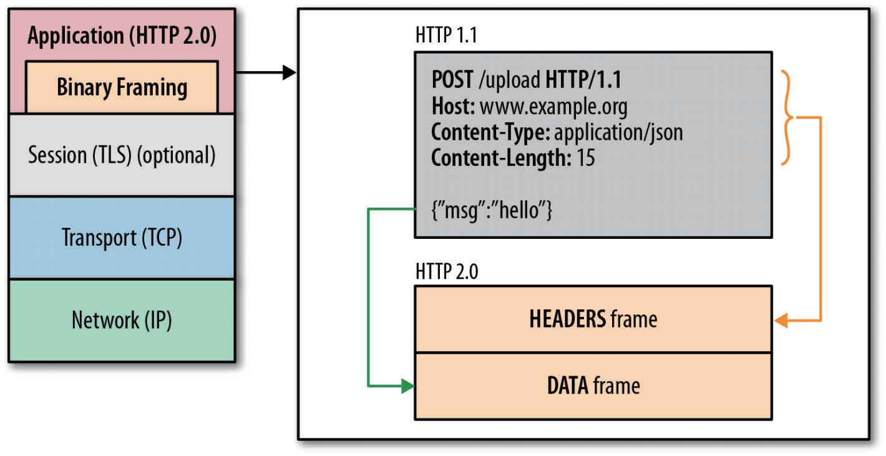
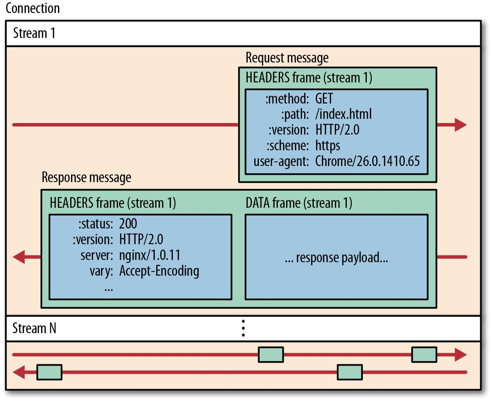
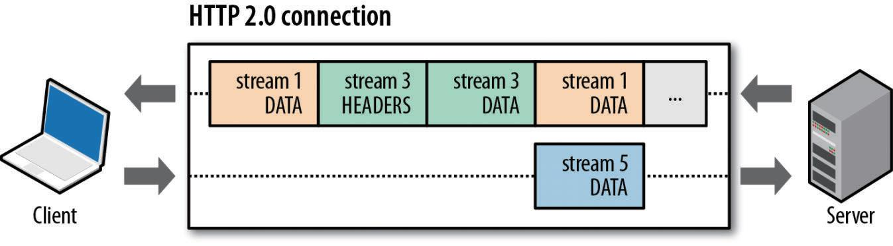
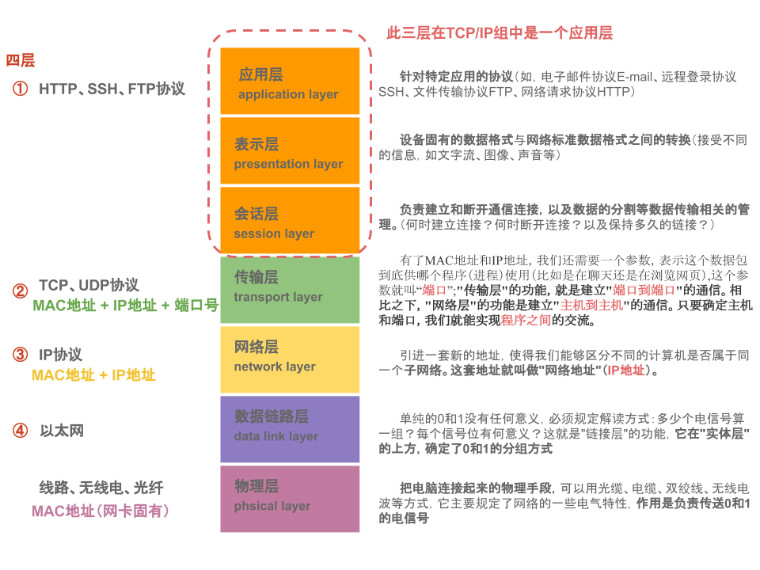
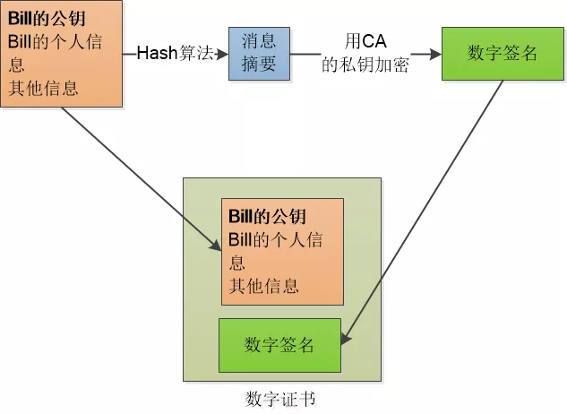
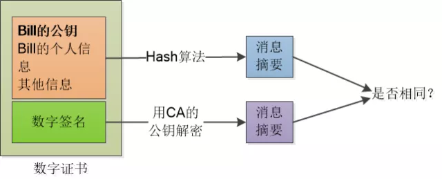

# HTTP版本 && HTTPS
## 一、HTTP 各版本
### http1.0:
1. 是一种无状态、无连接的应用层协议，每个请求都会新创建一个tcp连接，不支持长连接
2. `http1.0` 在一个请求接收到响应之后才会接着发送下一个，这也造成了 `head of line blocking(队头阻塞)`

### http1.1:
1. [缓存处理](浏览器缓存.md)：在 `HTTP1.0` 中主要使用`If-Modified-Since`、`Expires` 来做缓存，`HTTP1.1` 则引入了更多的缓存控制策略例如 `Etag`、`Cache-Control`等更多可供选择的缓存头来控制缓存策略
2. 带宽优化及网络连接的使用：`HTTP1.0`中，存在一些浪费带宽的现象，例如客户端只是需要某个对象的一部分，而服务器却将整个对象送过来了，并且不支持断点续传功能。`HTTP1.1` 则在请求头引入了 `range` 头域，它允许只请求资源的某个部分，这样就方便了开发者自由的选择以便于充分利用带宽和连接
3. Host头处理：在 `HTTP1.0` 中认为每台服务器都绑定一个唯一的IP地址，因此，请求消息中的URL并没有传递主机名。但随着虚拟主机技术的发展，在一台物理服务器上可以存在多个虚拟主机，并且它们共享一个IP地址。`HTTP1.1` 的请求消息和响应消息都应支持 `Host` 头域，且请求消息中如果没有 `Host` 头域会报告一个错误`（400 Bad Request）`
4. 长连接：`HTTP 1.1` 支持长连接和请求的流水线（Pipelining）处理，在一个TCP连接上可以传送多个HTTP请求和响应，减少了建立和关闭连接的消耗和延迟，在 `HTTP1.1` 中默认开启 `Connection: keep-alive`，一定程度上弥补了 `HTTP1.0` 每次请求都要创建连接的缺点
### http2.0 : 
回顾一下 `HTTP/2.0` 宣言草稿，因为这份宣言明确了该协议的范围和关键设计要求：  
`HTTP/2.0` 应该满足如下条件：
- 相对于使用 TCP 的 HTTP 1.1，用户在大多数情况下的感知延迟要有实质上、可度量的改进
- 解决 HTTP 中的“队首阻塞”问题
- 并行操作无需与服务器建立多个连接，从而改进 TCP 的利用率，特别是拥塞控制方面
- 保持 HTTP 1.1 的语义，利用现有文档，包括（但不限于）HTTP 方法、状态码、URI，以及首部字段
- 明确规定 HTTP 2.0 如何与 HTTP 1.x 互操作，特别是在中间介质上
- 明确指出所有新的可扩展机制以及适当的扩展策略

#### 一、二进制分帧
`HTTP/2.0` 性能增强的核心，全在于新增的二进制分帧层，它定义了如何
封装 HTTP 消息并在客户端与服务器之间传输。  

新的二进制分帧机制改变了客户端与服务器之间交互数据的方式。为了
说明这个过程，我们需要了解 `HTTP/2.0` 的几个新概念
- 流: 已建立的连接上的双向字节流
- 消息: 与逻辑消息对应的完整的一系列数据帧
- 帧: `HTTP 2.0` 通信的最小单位，每个帧包含帧首部，至少也会标识出当前帧所属的流

**所有 `HTTP/2.0` 通信都在一个连接上完成，这个连接可以承载任意数量的双向数据流。相应地，每个数据流以消息的形式发送，而消息由一或多个帧组成，这些帧可以乱序发送，然后再根据每个帧首部的流标识符重新组装**  

- 所有通信都在一个 TCP 连接上完成。
- 流是连接中的一个虚拟信道，可以承载双向的消息；每个流都有一个唯一的整数
标识符（1、2…N）。
- 消息是指逻辑上的 HTTP 消息，比如请求、响应等，由一或多个帧组成。
- 帧是最小的通信单位，承载着特定类型的数据，如 HTTP 首部、负荷，等等。
#### 二、多路复用
在 `HTTP/1.x` 中，如果客户端想发送多个并行的请求以及改进性能，那么必须使用
多个 TCP 连接。这是 `HTTP/1.x` 交付模型的直接结果，该模型会保证每个连接每次只交付一个响应（多个响应必须排队）。更糟
糕的是，这种模型也会导致`队首阻塞`，从而造成底层 TCP 连接的效率低下。

`HTTP/2.0` 中新的二进制分帧层突破了这些限制，实现了多向请求和响应：客户端和
服务器可以把 HTTP 消息分解为互不依赖的帧，然后乱序发送，最后再在另一端把它们重新组合起来。

图中包含了同一个连接上多个传输中的数据流：客户端正在向服务器传输一个
DATA 帧（stream 5），与此同时，服务器正向客户端乱序发送 stream 1 和 stream 3
的一系列帧。此时，一个连接上有 3 个请求 / 响应并行交换！  

把 HTTP 消息分解为独立的帧，交错发送，然后在另一端重新组装是 `HTTP/2.0` 最
重要的一项增强。事实上，这个机制会在整个 Web 技术栈中引发一系列连锁反应，
从而带来巨大的性能提升，因为：
- 可以并行交错地发送请求，请求之间互不影响；
- 可以并行交错地发送响应，响应之间互不干扰；
- 只使用一个连接即可并行发送多个请求和响应；
- 消除不必要的延迟，从而减少页面加载的时间；
- 不必再为绕过 HTTP 1.x 限制而多做很多工作；

总之，`HTTP/2.0` 的二进制分帧机制解决了 `HTTP/1.x` 中存在的`队首阻塞`问题，也消除了并行处理和发送请求及响应时对多个连接的依赖。结果，就是应用速度更快、
开发更简单、部署成本更低。

#### 三、请求优先级
把 HTTP 消息分解为很多独立的帧之后，就可以通过优化这些帧的交错和传输顺序，
进一步提升性能。为了做到这一点，每个流都可以带有一个 31 比特的优先值。有了这个优先值，客户端和服务器就可以在处理不同的流时采取不同的策略，以最优的方式发送流、消息和帧。具体来讲，服务器可以根据流的优先级，控制资源分配（CPU、内存、带宽），而在响应数据准备好之后，优先将最高优先级的帧发送给客户端。

#### 四、首部压缩
首部压缩（HPACK压缩算法，一边用index mapping table压缩，一边编码，这个table由静态表和动态表组成）

- `HTTP/2.0` 会压缩首部元数据：在客户端和服务器端使用“首部表”来跟踪和存储之前发送的键值对，对于相同的数据，不再通过每次请求和响应发送；“首部表”在 `HTTP/2.0` 的连接存续期内始终存在，由客户端和服务器共同渐进地更新；每个新的首部键值对要么追加到当前表的末尾，要么替换表中之前的值
- `HTTP/2.0` 首部差异化传输
  - 请求与响应首部的定义在 `HTTP/2.0` 中基本没有改变，只是所有首部键`必须全部小写`，而且请求行要独立为 :method、:scheme、:host、:path这些键值对

#### 五、服务端推送
- `HTTP/2.0` 新增的一个强大的新功能，就是服务器可以对一个客户端请求发送多个响应。服务器向客户端推送资源无需客户端明确地请求。

- `HTTP/2.0` 连接后，客户端与服务器交换 `SETTINGS` 帧，借此可以限定双向并发的流的最大数量。因此，客户端可以限定推送流的数量，或者通过把这个值设置为 `0` 而完全禁用服务器推送。
- 所有推送的资源都遵守`同源策略`。换句话说，服务器不能随便将第三方资源推送给客户端，而必须是经过双方确认才行。
- `PUSH_PROMISE`：所有服务器推送流都由 `PUSH_PROMISE` 发端，服务器向客户端发出的有意推送所述资源的信号。客户端接收到 `PUSH_PROMISE` 帧之后，可以视自身需求选择拒绝这个流
- 几点限制：
  - 服务器必须遵循 请求-响应 的循环，只能借着对请求的响应推送资源
  - `PUSH_PROMISE` 帧必须在返回响应之前发送，以免客户端出现竞态条件
## HTTPS 
### 基本概念
先回顾下 ISO 网络七层协议  

HTTPS 是基于 HTTP 的扩展，用于计算机网络的安全通信，已经在互联网得到广泛应用。在 HTTPS 中，原有的 HTTP 协议会得到 TLS (安全传输层协议) 或其前辈 SSL (安全套接层) 的加密

### 加解密过程

### 名词解释
#### 一、数字证书
##### 产生背景
如果一开始服务端发送的公钥到客户端的过程中被第三方劫持，然后第三方自己伪造一对密钥，将公钥发送给客户端，当服务器发送数据给客户端的时候，中间人将信息进行劫持，用一开始劫持的公钥进行解密后，然后使用自己的私钥将数据加密发送给客户端，而客户端收到后使用公钥解密，反过来亦是如此，整个过程中间人是透明的，但信息泄露却不得而知。

##### 内容 与 认证原理
数字证书是由权威的 CA 机构给服务端进行颁发，CA 机构通过服务端提供的相关信息生成证书，证书内容包含了持有人的`相关信息`，`服务器的公钥`，`数字签名`等

**认证过程**  

