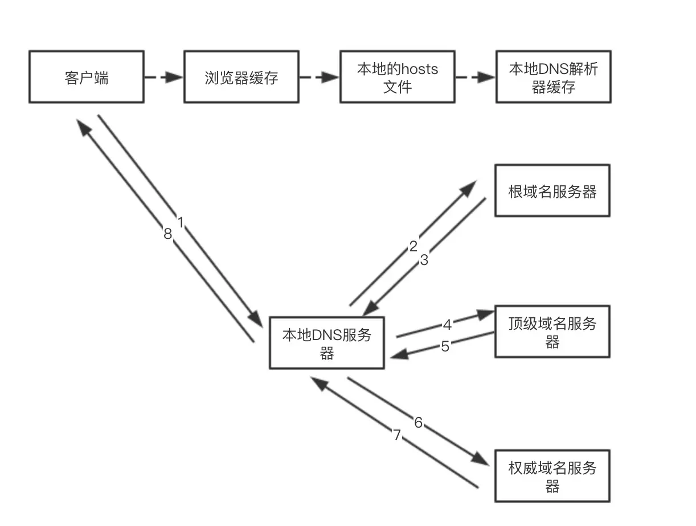

## 从URL输入到页面展现到底发生什么？
总体来说分为以下几个过程：

1. [DNS 解析](#二dns协议-与-cdn)：将域名解析成 IP 地址
2. [TCP 连接](TCP协议.md)：TCP 三次握手
3. 发送 HTTP 请求
4. 服务器处理请求并返回 HTTP 报文
5. 浏览器解析渲染页面
6. [断开连接](TCP协议.md)：TCP 四次挥手

### 一、URL 与 URI
URL(Uniform Resource Locator): 统一资源定位符  
URI(Uniform Resource Identifier): 统一资源标识符  

- scheme 表示协议名，比如http, https, file等等。后面必须和://连在一起
- user:passwd@ 表示登录主机时的用户信息，不过很不安全，不推荐使用，也不常用
- host:port 表示主机名和端口
- path 表示请求路径，标记资源所在位置
- query 表示查询参数，为 `key=val` 这种形式，多个键值对之间用 & 隔开
- fragment 表示定位的资源内的一个锚点，浏览器可以根据这个锚点跳转到对应的位置
### 二、DNS协议 与 CDN
#### DNS协议
DNS(Domain Name System)：域名系统，是互联网上作为域名和 IP 地址相互映射的一个分布式数据库。  
通过域名，最终得到该域名对应的IP地址的过程叫做`域名解析`
#### DNS解析过程
- 浏览器缓存：浏览器会按照一定的频率缓存 DNS 记录
- 操作系统缓存：`hosts` 文件可以指定 `域名 IP` 映射关系
- 路由缓存：路由器也有 DNS 缓存。
- ISP 的 DNS 服务器：ISP 是互联网服务提供商(Internet Service Provider)的简称，ISP 有专门的 DNS 服务器应对 DNS 查询请求
- 根服务器：ISP 的 DNS 服务器还找不到的话，它就会向根服务器发出请求，进行递归查询

#### 什么是 CDN
CDN (Content Delivery Network)：内容分发网络，由分布在不同区域的边缘节点服务器群组成的分布式网络，替代传统以 WEB Server 为中心的数据传输模式

作用是将源内容发布到边缘节点，配合精准的调度系统，将用户的请求分配至最适合他的节点，使用户可以以最快的速度取得他所需的内容，提高用户访问的响应速度。

#### CDN 基本工作过程
1. 当用户点击网站页面上的内容 URL，经过本地 DNS 系统解析，DNS 系统会最终将域名的解析权交给 `CNAME` 指向的 `CDN 专用 DNS 服务器`
2. 用户向 `CDN 专用 DNS 服务器` 发起内容 URL 访问请求
3. `CDN 专用 DNS 服务器` 根据用户 IP 地址，以及用户请求的内容URL，返回一台缓存服务器的IP地址：
   - 根据用户 IP 地址，判断哪一台服务器距用户最近
   - 根据用户所请求的 URL 中携带的内容名称，判断哪一台服务器上有用户所需内容
   - 查询各个服务器当前的负载情况，判断哪一台服务器尚有服务能力
4. `CDN 专用 DNS 服务器` 把服务器的 IP 地址返回给用户

