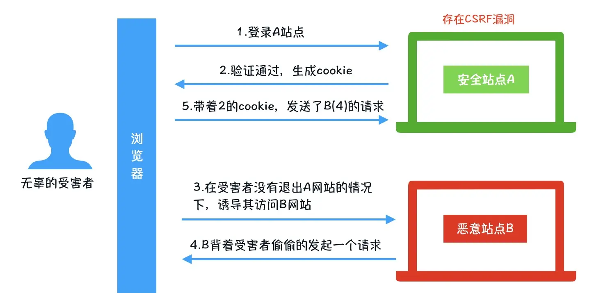

# 常见web攻击总结
- XSS攻击（关键是脚本，利用恶意脚本发起攻击）
- DDOS攻击（关键是发出大量请求，最后令服务器崩溃）
- CSRF攻击（关键是借助本地cookie进行认证，伪造发送请求）  

## 1. XSS
`XSS(Cross-Site Scripting)` 跨站脚本攻击，是一种代码注入攻击。攻击者在目标网站上注入恶意代码，当被攻击者登陆网站时就会执行这些恶意代码，这些脚本可以读取 `cookie` 或者冒充用户身份。  

XSS 的本质是：恶意代码未经过滤，与网站正常的代码混在一起；浏览器无法分辨哪些脚本是可信的，导致恶意脚本被执行。由于直接在用户的终端执行，恶意代码能够直接获取用户的信息，利用这些信息冒充用户向网站发起攻击者定义的请求。

根据攻击的来源，XSS攻击可以分为 `存储型`、`反射型` 和 `DOM型` 三种

### 1.1 反射型XSS
当用户点击一个恶意链接，或者提交一个表单，或者进入一个恶意网站时，注入脚本进入被攻击者的网站。Web服务器将注入脚本，未进行过滤直接返回到用户的浏览器上。

#### 反射型 XSS 的攻击步骤：

- 攻击者构造出特殊的 URL，其中包含恶意代码
- 用户打开带有恶意代码的 URL 时，网站服务端将恶意代码从 URL 中取出，拼接在 HTML 中返回给浏览器
- 用户浏览器接收到响应后解析执行，混在其中的恶意代码也被执行
- 恶意代码窃取用户数据并发送到攻击者的网站，或者冒充用户的行为，调用目标网站接口执行攻击者指定的操作

#### 如何防范反射型XSS攻击：

- 对字符串进行编码  
- 对 URL 的查询参数进行转义后再输出到页面

### 1.2 DOM 型 XSS
DOM 型 XSS 攻击，实际上就是前端 JavaScript 代码不够严谨，把不可信的内容插入到了页面

#### DOM 型 XSS 的攻击步骤：

- 攻击者构造出特殊数据，其中包含恶意代码
- 用户浏览器执行了恶意代码
- 恶意代码窃取用户数据并发送到攻击者的网站，或者冒充用户的行为，调用目标网站接口执行攻击者指定的操作

#### 如何防范 DOM 型 XSS 攻击：

- 对于 URL 链接，使用 `encodeURIComponent` 来转义
- 非 URL，对内容进行编码转义

### 1.3 存储型 XSS
存储型XSS攻击的原因仍然是没有做好数据过滤：
- 前端提交数据至服务端时，没有做好过滤
- 服务端在接受到数据时，在存储之前，没有做过滤
- 前端从服务端请求到数据，没有过滤输出。

#### 存储型 XSS 的攻击步骤：
- 攻击者将恶意代码提交到目标网站的数据库中
- 用户打开目标网站时，网站服务端将恶意代码从数据库取出
- 用户浏览器接收到响应后解析执行，混在其中的恶意代码也被执行

这种攻击常见于带有用户保存数据的网站功能，如`论坛发帖`、`商品评论`、`用户私信`等

#### 如何防范存储型 XSS 攻击：

- 前端数据传递给服务器之前，先转义/过滤(防范不了抓包修改数据的情况)
- 服务器接收到数据，在存储到数据库之前，进行转义/过滤
- 前端接收到服务器传递过来的数据，在展示到页面前，先进行转义/过滤

## 2. DDOS
分布式拒绝服务攻击（DDOS），发送大量请求是使服务器瘫痪。DDos 攻击是在 DOS 攻击基础上的，借助公共网络，将大数量的计算机设备联合起来，向一个或多个目标进行攻击

常见DDOS：[SYN宏泛攻击](TCP协议.md)

## 3. CSRF
CSRF（Cross-site request forgery）跨站请求伪造：攻击者利用浏览器访问网页时会自动携带上 `Cookie` 的特性，通过 `Cookie` 伪造为合法用户

### CSRF 的攻击步骤：

1. 浏览并登录信任网站A  
2. 验证通过，在用户处（C）产生A的 `Cookie`  
3. 用户在A处 `Cookie` 未到期的时候，访问危险网站B  
4. B要求访问第三方站点（A），发出一个request请求  
5. 根据B的请求，浏览器带着用户C的 `Cookie` 访问A  
6. A不知道请求是C发出的还是B发出的，所以A会根据用户C的权限来处理此次请求，这样B就达到了模拟用户操作的目的    

### 如何预防CSRF攻击：
- 添加验证码(体验不好)  
验证码能够防御CSRF攻击，可以在转账，交易等敏感操作时，增加验证码
- 判断请求的来源  
检测 `Referer` (并不安全，`Referer` 可以被更改)
- 使用 `token` (主流)
  - 服务端给用户生成一个 `token`，加密后传递给用户
  - 用户在提交请求时，需要携带这个 `token`
  - 服务端验证 `token` 是否正确
- [SameSite](Cookie.md)  
`SameSite` 来标明 `Cookie` 是个`"同站 Cookie"`  
部署简单，并能有效防御CSRF攻击，但是存在兼容性问题`