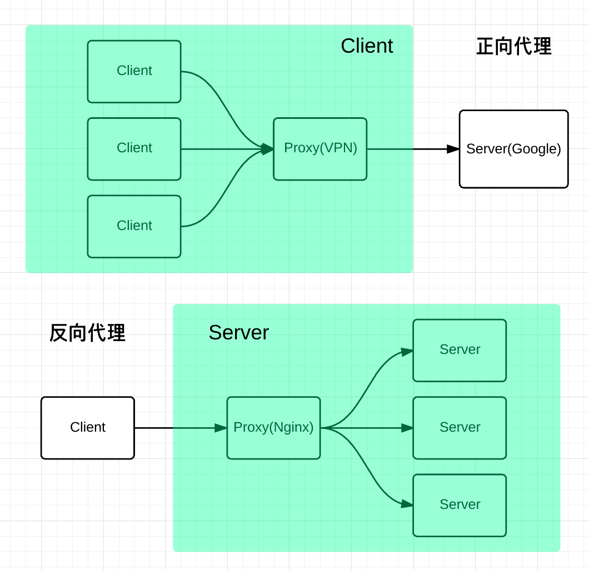

# 什么是跨域？如何解决？

## 什么是跨域
回顾一下 URI 的组成：  

浏览器遵循**同源政策**（`scheme(协议)`、`host(主机)` 和 `port(端口)` 都相同则为 `同源`）。非同源站点有这样一些限制:

- 不能读取和修改对方的 `DOM`
- 不读访问对方的 `Cookie`、`IndexDB` 和 `LocalStorage`
- 限制 `XMLHttpRequest` 请求。(着重围绕这个)

当浏览器向目标 URI 发 Ajax 请求时，只要当前 URL 和目标 URL 不同源，则产生跨域，被称为 `跨域请求`。

## 跨域解决方案
### 1. CORS
#### 一、简介
CORS 是一个W3C标准，全称是 `跨域资源共享`。  
它允许浏览器向跨源服务器，发出 `XMLHttpRequest` 请求，从而克服了 `AJAX` 只能同源使用的限制。

CORS 需要浏览器和服务器同时支持。目前，所有浏览器都支持该功能（IE不能低于IE10）  
整个 CORS 通信过程，都是浏览器自动完成，不需要用户参与。对于开发者来说，CORS 通信与同源的AJAX通信没有差别，代码完全一样。浏览器一旦发现AJAX请求跨源，就会自动添加一些附加的头信息，有时还会多出一次附加的请求，但用户不会有感觉。  
因此，实现CORS通信的关键是服务器。只要服务器实现了CORS接口，就可以跨源通信。  

#### 二、两种请求
浏览器将CORS请求分成两类：`简单请求（simple request）` 和 `非简单请求（not-so-simple request）`  

满足下面条件的属于 `简单请求`，否则就是 `非简单请求`

(1) 请求方法是以下三种方法之一：
- HEAD
- GET
- POST  

(2)HTTP的头信息不超出以下几种字段：
- Accept
- Accept-Language
- Content-Language
- Content-Type：只限于三个值 `text/plain`、`multipart/form-data`、`application/x-www-form-urlencoded`

#### 三、简单请求
##### 3.1 基本流程
对于简单请求，浏览器直接发出CORS请求。具体来说，就是在头信息之中，增加一个 `Origin` 字段。

下面是一个例子，浏览器发现这次跨源AJAX请求是简单请求，就自动在头信息之中，添加一个 `Origin` 字段。

```nginx
GET /cors HTTP/1.1
Origin: http://api.bob.com
Host: api.alice.com
Accept-Language: en-US
Connection: keep-alive
User-Agent: Mozilla/5.0...
```

上面的头信息中，`Origin` 字段用来说明，本次请求来自哪个源（协议 + 域名 + 端口）。服务器根据这个值，决定是否同意这次请求。

1. 如果 `Origin` 指定的源，不在许可范围内，服务器会返回一个正常的HTTP响应。浏览器发现，这个回应的头信息没有包含`Access-Control-Allow-Origin` 字段，就知道出错了，从而抛出一个错误，被 `XMLHttpRequest` 的 `onerror` 回调函数捕获。注意，这种错误无法通过状态码识别，因为HTTP回应的状态码有可能是200。

2. 如果 `Origin` 指定的域名在许可范围内，服务器返回的响应，会多出几个头信息字段。
   ```nginx
   Access-Control-Allow-Origin: http://api.bob.com
   Access-Control-Allow-Credentials: true
   Access-Control-Expose-Headers: FooBar
   Content-Type: text/html; charset=utf-8
   ```

上面的头信息之中，有三个与CORS请求相关的字段，都以 `Access-Control-` 开头。

1. `Access-Control-Allow-Origin`  
该字段是必须的。它的值要么是请求时 `Origin` 字段的值，要么是一个 `*`，表示接受任意域名的请求。

1. `Access-Control-Allow-Credentials`  
该字段可选。它的值是一个布尔值，表示是否允许发送Cookie。默认情况下，Cookie不包括在CORS请求之中。设为true，即表示服务器明确许可，Cookie可以包含在请求中，一起发给服务器。这个值也只能设为true，如果服务器不要浏览器发送Cookie，删除该字段即可。

1. `Access-Control-Expose-Headers`  
该字段可选。CORS请求时，`XMLHttpRequest` 对象的 `getResponseHeader()` 方法只能拿到6个基本字段：`Cache-Control`、`Content-Language`、`Content-Type`、`Expires`、`Last-Modified`、`Pragma`。如果想拿到其他字段，就必须在 `Access-Control-Expose-Headers` 里面指定。上面的例子指定，`getResponseHeader('FooBar')` 可以返回 `FooBar` 字段的值。

#### 四、非简单请求
##### 4.1 预检请求
非简单请求的CORS请求，会在正式通信之前，增加一次HTTP查询请求，称为 `预检请求`（preflight）。

浏览器先询问服务器，当前网页所在的域名是否在服务器的许可名单之中，以及可以使用哪些 `HTTP请求方法` 和 `头信息` 字段。只有得到肯定答复，浏览器才会发出正式的 `XMLHttpRequest` 请求，否则就报错。

下面是一段浏览器的JavaScript脚本。
```JavaScript
var url = 'http://api.alice.com/cors';
var xhr = new XMLHttpRequest();
xhr.open('PUT', url, true);
xhr.setRequestHeader('X-Custom-Header', 'value');
xhr.send();
```

上面代码中，HTTP请求的方法是 `PUT`，并且发送一个自定义头信息 `X-Custom-Header`。

浏览器发现，这是一个非简单请求，就自动发出一个 `预检请求`，要求服务器确认可以这样请求。下面是这个"预检"请求的HTTP头信息。

```nginx
OPTIONS /cors HTTP/1.1
Origin: http://api.bob.com
Access-Control-Request-Method: PUT
Access-Control-Request-Headers: X-Custom-Header
Host: api.alice.com
Accept-Language: en-US
Connection: keep-alive
User-Agent: Mozilla/5.0...
```

`预检请求` 用的请求方法是 `OPTIONS`，表示这个请求是用来询问的。头信息里面，关键字段是 `Origin`，表示请求来自哪个源。

除了 `Origin` 字段，`预检请求` 的头信息包括两个特殊字段。

1. `Access-Control-Request-Method`

该字段是必须的，用来列出浏览器的CORS请求会用到哪些 `HTTP请求方法`，上例是 `PUT`。

2. `Access-Control-Request-Headers`

该字段是一个逗号分隔的字符串，指定浏览器CORS请求会额外发送的头信息字段，上例是 `X-Custom-Header`。

##### 4.2 预检请求的回应
服务器收到 `预检请求` 以后，检查了 `Origin`、`Access-Control-Request-Method` 和 `Access-Control-Request-Headers` 字段以后，确认允许跨源请求，就可以做出回应。

```nginx
HTTP/1.1 200 OK
Date: Mon, 01 Dec 2008 01:15:39 GMT
Access-Control-Allow-Origin: http://api.bob.com
Access-Control-Allow-Methods: GET, POST, PUT
Access-Control-Allow-Headers: X-Custom-Header, Other
Content-Type: text/html; charset=utf-8
Content-Encoding: gzip
Content-Length: 0
Keep-Alive: timeout=2, max=100
Connection: Keep-Alive
Content-Type: text/plain
```

上面的HTTP响应中，关键的是 `Access-Control-Allow-Origin` 字段，表示 `http://api.bob.com` 可以请求数据。该字段也可以设为 `*`，表示同意任意跨源请求。


如果服务器否定了 `预检请求`，会返回一个正常的HTTP响应，但是没有任何CORS相关的头信息字段。这时，浏览器就会认定，服务器不同意 `预检请求`，因此触发一个错误，被 `XMLHttpRequest` 对象的 `onerror` 回调函数捕获  

服务器回应的其他CORS相关字段如下：
1. `Access-Control-Allow-Methods`  
该字段必需，它的值是逗号分隔的一个字符串，表明服务器支持的所有跨域请求的方法。注意，返回的是所有支持的方法，而不单是浏览器请求的那个方法。这是为了避免多次"预检"请求。

1. `Access-Control-Allow-Headers`  
如果浏览器请求包括Access-Control-Request-Headers字段，则Access-Control-Allow-Headers字段是必需的。它也是一个逗号分隔的字符串，表明服务器支持的所有头信息字段，不限于浏览器在"预检"中请求的字段。

1. `Access-Control-Allow-Credentials`  
该字段与简单请求时的含义相同

1. `Access-Control-Max-Age`  
该字段可选，用来指定本次预检请求的有效期，单位为秒，允许缓存该条回应时间，在此期间，不用发出另一条预检请求。  
注：必须相同url才会被缓存，get请求拼接不同的参数视为不同url

##### 4.3 浏览器的正常请求和回应
一旦服务器通过了 `预检请求`，以后每次浏览器正常的CORS请求，就都跟 `简单请求` 一样，会有一个 `Origin` 头信息字段。服务器的响应，也都会有一个 `Access-Control-Allow-Origin` 头信息字段。

下面是 `预检请求` 之后，浏览器的正常CORS请求：  
头信息的 `Origin` 字段是浏览器自动添加的  
```nginx
PUT /cors HTTP/1.1
Origin: http://api.bob.com
Host: api.alice.com
X-Custom-Header: value
Accept-Language: en-US
Connection: keep-alive
User-Agent: Mozilla/5.0...
```

下面是服务器正常的响应：  
头信息中，`Access-Control-Allow-Origin` 字段是每次响应都必定包含的
```nginx
Access-Control-Allow-Origin: http://api.bob.com
Content-Type: text/html; charset=utf-8
```

### 2. JSONP
虽然 `XMLHttpRequest对象` 遵循 `同源政策`，但是 `script` 标签（拥有src属性的标签）不一样，它可以通过 `src` 填上目标地址从而发出 `GET` 请求，实现跨域请求并拿到响应，这也就是 `JSONP` 的原理。

和CORS相比，JSONP 最大的优势在于兼容性好，IE 低版本不能使用 CORS 但可以使用 JSONP，缺点也很明显，请求方法单一，只支持 `GET` 请求。

### 3. Nginx 代理
Nginx 是一种高性能的反向代理服务器，可以用来轻松解决跨域问题  
关于 `正向代理` 和 `反向代理`  

 
`正向代理` 帮助客户端访问客户端自己访问不到的服务器，然后将结果返回给客户端。

`反向代理` 拿到客户端的请求，将请求转发给其他的服务器，主要的场景是维持服务器集群的负载均衡，换句话说，`反向代理` 帮其它的服务器拿到请求，然后选择一个合适的服务器，将请求转交给它。

因此，两者的区别就很明显了，`正向代理` 服务器是帮客户端做事情，而 `反向代理` 服务器是帮其它的服务器做事情。

那 `Nginx` 是如何来解决跨域的呢：  
比如说现在客户端的域名为 `client.com`，服务器的域名为 `server.com`，客户端向服务器发送 `Ajax` 请求，当然会跨域了，那这个时候让 `Nginx` 登场了。  
`Nginx` 相当于起了一个跳板机，这个跳板机的域名也是 `client.com`，让客户端首先访问 `client.com/api`，这当然没有跨域，然后 `Nginx` 服务器作为 `反向代理`，将请求转发给 `server.com`，当响应返回时又将响应给到客户端，这就完成整个跨域请求的过程。